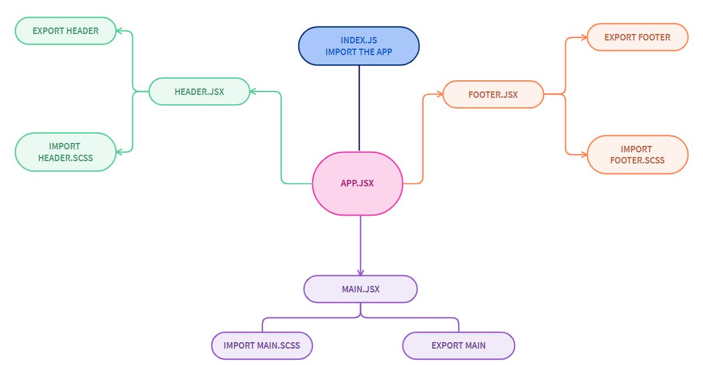

### **Component Based UI**

### **LAB - 26**

#### **Phase 1 Requirements**

Today, we begin the first of a 4-Phase build of the RESTy application, written in React. In this first phase, our goal is to setup the basic scaffolding of the application, with intent being to add more functionality to the system as we go. This initial build sets up the file structure so that we can progressively build this application in a scalable manner

The following user/developer stories detail the major functionality for this phase of the project.

* As a user, I expect an easy to read and understand user interface so that I can use the application intuitively
* As a user, I want to enter the URL to a REST API and select the REST method to use to access it
* As a user, I want visual confirmation that my entries and selections are valid so that I have confidence the application will be able to fetch the API data that I’ve requested

And as developers, here are the high level development tasks that address the above end user requirements

* Create a visually appealing site with a Header, Footer, and a large content area
* Create a form that asks for a URL
* Create buttons that let the user choose from the REST methods (get, post, put, delete)
* When the form is filled out, and the button is clicked, display the URL and the method chosen

### **Author: Farah AlWahaibi**

* [PR LINK1](https://github.com/farahalwahaibi/resty/pull/1)

* [PR LINK2](https://github.com/farahalwahaibi/resty/pull/2)

### **Installation**
* **dependencies :**
  *  "@testing-library/jest-dom"
  *  "@testing-library/react"
  *  "@testing-library/user-event"
  *  "react"
  *  "react-dom"
  *  "react-scripts"
  *  "sass"
  *  "web-vitals"
  *  "yarn"

### **Running the app**
* **npm start**

## **UML DIAGRAM**

***

***Thank you!!***

