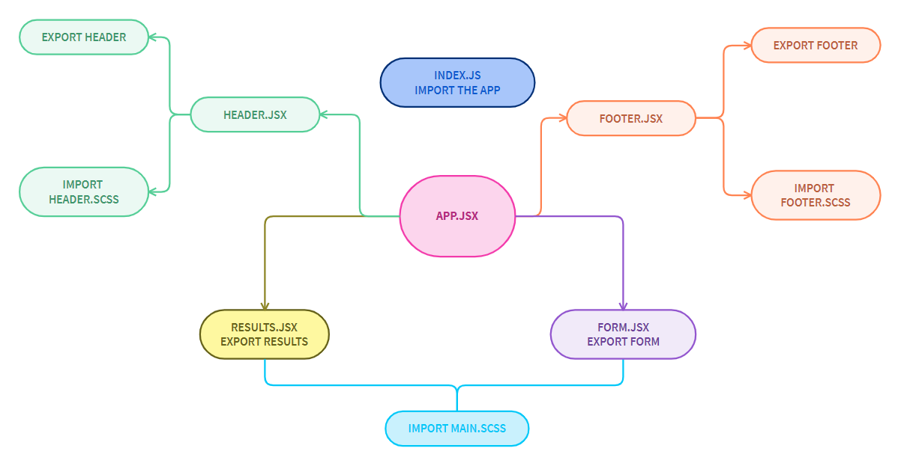
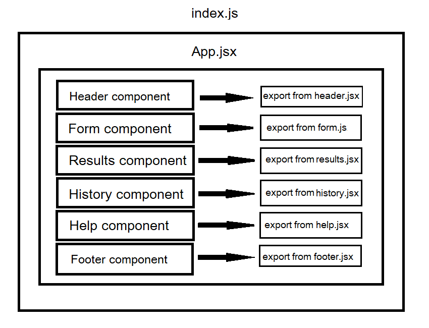
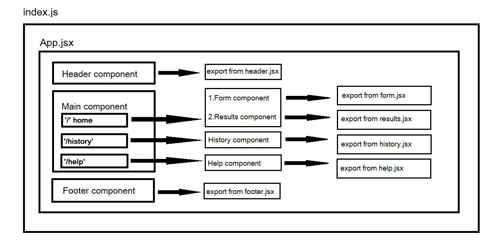

## **RESTy**

### **Author: Farah AlWahaibi**

***

### **LAB - 26**

## **Component Based UI**

#### **Phase 1 Requirements**

Today, we begin the first of a 4-Phase build of the RESTy application, written in React. In this first phase, our goal is to setup the basic scaffolding of the application, with intent being to add more functionality to the system as we go. This initial build sets up the file structure so that we can progressively build this application in a scalable manner

The following user/developer stories detail the major functionality for this phase of the project.

* As a user, I expect an easy to read and understand user interface so that I can use the application intuitively
* As a user, I want to enter the URL to a REST API and select the REST method to use to access it
* As a user, I want visual confirmation that my entries and selections are valid so that I have confidence the application will be able to fetch the API data that I’ve requested

And as developers, here are the high level development tasks that address the above end user requirements

* Create a visually appealing site with a Header, Footer, and a large content area
* Create a form that asks for a URL
* Create buttons that let the user choose from the REST methods (get, post, put, delete)
* When the form is filled out, and the button is clicked, display the URL and the method chosen

* [PR LINK1](https://github.com/farahalwahaibi/resty/pull/1)

* [PR LINK2](https://github.com/farahalwahaibi/resty/pull/2)

### **Installation**
* **dependencies :**
  *  "@testing-library/jest-dom"
  *  "@testing-library/react"
  *  "@testing-library/user-event"
  *  "react"
  *  "react-dom"
  *  "react-scripts"
  *  "sass"
  *  "web-vitals"
  *  "yarn"

### **Running the app**
* **npm start**

## **UML DIAGRAM PHASE-1**

***
***
***

### **LAB - 27**

## **Props And State**

#### **Phase 2 Requirements**

In phase 2, we will be connecting RESTy to live APIs, fetching and displaying remote data. Our primary focus will be to service GET requests

The following user stories detail the major functionality for this phase of the project.

* As a user, I want to enter the URL to an API and issue a GET request so that I can retrieve it’s data
* As a user, I want to see the results returned from an API request in my browser in a readable format

Application Flow:

* User enters an API URL
* Chooses a REST Method
* Clicks the “Go” button
* Application fetches data from the URL given, with the method specified
* Displays the response headers and results separately
* Both headers and results should be “pretty printed” JSON

### **PR URL :**

* [PR LINK1](https://github.com/farahalwahaibi/resty/pull/3)

* [PR LINK2](https://github.com/farahalwahaibi/resty/pull/4)

### **Installation**
* **dependencies :**
  *  "react-json-view"
  *  "react-json-pretty"

## **UML DIAGRAM PHASE-2**

***
***
***

### **LAB - 28**

## **Component Composition**

#### **Phase 3 Requirements**

In this phase of the RESTy build, we will be adding some more fidelity to the application, including a menu, history, and an “in-progress” spinner.

The following user stories detail the major functionality for this phase of the project.

* As a user, I want to be able to use all REST methods so that I can do more than just get data
* As a user, I want a simple list of all previous queries I’ve run so that I can easily see which queries I’ve run before
* As a user, I want to click on an old query and have my selections appear in the form for me, so I don’t have to re-type them
* As a user, I want to see a “loading” indicator while RESTy is fetching data so that I know it’s working on my request

### **PR URL :**

* [PR LINK1](https://github.com/farahalwahaibi/resty/pull/6)

## **UML DIAGRAM PHASE-3**

***
***
***

### **LAB - 29**

## **Routing**

#### **Phase 4 Requirements**

In this final phase of the RESTy build, we will be adding some more fidelity to the application, including a menu with a ore detailed view of our history, as well as an about us page.

The following user stories detail the major functionality for this phase of the project.

* As a user, I want to see all of my previous queries as a separate page so that I can browse them in greater detail
* As a user, I would like to view a separate “Help” page so I can learn how the application works

### **PR URL :**

* [PR LINK1](https://github.com/farahalwahaibi/resty/pull/6)

### **Installation**
* **dependencies :**
  *  "react-router-dom"

## **UML DIAGRAM PHASE-4**

***
***
***

***Thank you!!***

